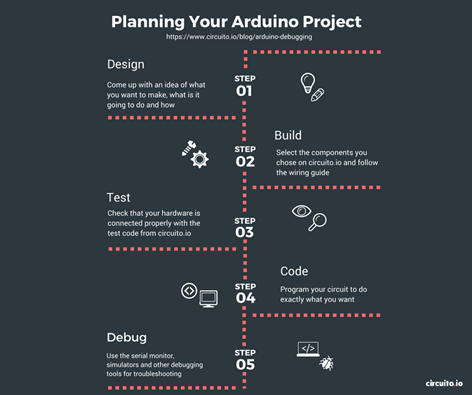

# Introduction

Avant de commencer à programmer un microcontrôleur, la première chose à faire consiste à regarder la documentation associée, dite « **Datashee**t », ainsi que les caractéristiques et performances de ce microcontrôleur. Autrement dit, nous ne pouvons pas dissocier la partie Hardware de la partie Software qui a pour objectif d’exploiter au mieux les possibilités offertes par le microcontrôleur. Pour cela, identifiez la carte et les composants intégrés principaux sur le site de référence : [http://esp32.net/#Hardware](http://esp32.net/#Hardware). Bien sûr, un passage par le site du constructeur de l’ESP32 (successeur de l’ESP8266) est incontournable, le site d’Espressif :



<figure><figcaption></figcaption></figure>

Définissez sur quelle carte vous travaillez en remplissant les champs suivants, par exemple :

| Maker             | Model        | Surface-Mount module | USB  UART     | Notes         |
| ----------------- | ------------ | -------------------- | ------------- | ------------- |
| Guoyun Technology | Goouuu-ESP32 | ESP-WROOM-32         | Silabs CP2102 | Carte hybride |

Ensuite, trouvez le schéma « pinout » de votre microcontrôleur afin de faire les branchements avec les bonnes pattes (voir ci-dessous). Faites attention aux valeurs de tensions et de courant à respecter : 3,3 V et 5V et environ 8 mA à 16 mA maximum par patte.

_Exemple de schéma « pinout » pour l’ESP-WROOM-32 Module du NodeMCU_
