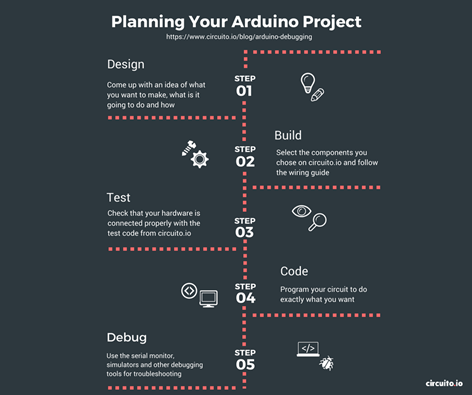

# Premier projet Arduino

**Faire un projet sur ESP32**

Pour un projet ESP32, l’un des moyens les plus simples et pratiques est fourni par le site [http://www.circuito.io](http://www.circuito.io). Vous trouverez les différentes étapes, dont le schéma ci-dessous, avec ce lien : [https://www.circuito.io/blog/arduino-debugging/](https://www.circuito.io/blog/arduino-debugging/).

<figure><figcaption></figcaption></figure>

Sur le site internet circuito.io, faire le montage ci-dessous avec deux LED en sortie de l’ESP32 : une LED rouge et une LED bleue, puis cliquez sur Code pour obtenir le code généré en ligne automatiquement et téléchargeable :

<figure><figcaption></figcaption></figure>

Sur la partie DESIGN, en survolant les résistances avec la souris, vous obtenez leur valeur : résistance de 100 ohms en série avec la LED rouge et une résistance de 47 ohms en série avec la LED bleue.

<figure><figcaption></figcaption></figure>

**Travail à faire :**

* Téléchargez l'ensemble des fichiers contenant le code : firmware.zip
* Etudiez-les (fichiers .cpp, .h et .ino) et comprenez leur fonctionnement &#x20;
* Adaptez le code au module NodeMCU-ESP32
* Faire le montage électronique associé (2 LED et 2 résistances), voir le schéma de votre microcontrôleur pour les broches !
* Téléversez le code et faites fonctionner l’ensemble sur l’IDE Arduino

**Remarques sur le code :**

Fonctionnement : un menu vous permet de sélectionner la LED que vous allez faire clignoter avec une intensité variable, l'autre LED étant complètement éteinte.

Le programme Firmaware.ino ne fonctionne pas. C'est normal car la fonction AnalogWrite() d'Arduino n'est pas reconnue par l'ESP32. Il faudra la remplacer. Pour cela, vous devez comprendre la modulation par largeur d'impulsion PWM

Le fonctionnement
